# 中国银行股份有限公司

股票代码：601988

2024 年年度报告

# 中国银行简介

中国银行是中国持续经营时间最久的银行。1912年2月正式成立，先后行使中央银行、国际汇兑银行和国际贸易专业银行职能。1949 年以后，长期作为国家外汇外贸专业银行，统一经营管理国家外汇，开展国际贸易结算、侨汇和其他非贸易外汇业务。1994年改组为国有独资商业银行，全面提供各类金融服务，发展成为本外币兼营、业务品种齐全、实力雄厚的大型商业银行。2006 年率先成功在香港联交所和上交所挂牌上市，成为国内首家“A+H”上市银行。中国银行是 2008 年北京夏季奥运会和 2022 年北京冬季奥运会唯一官方银行合作伙伴，是中国唯一的“双奥银行”。2011年，中国银行成为新兴经济体中首家全球系统重要性银行，目前已连续14年入选，国际地位、竞争能力、综合实力跻身全球大型银行前列。当前，中国银行对标党中央决策部署，以服务实体经济为根本宗旨，以防控风险为永恒主题，以巩固扩大全球化优势、提升全球布局能力为首要任务，着力做好科技金融、绿色金融、普惠金融、养老金融、数字金融五篇大文章，在实干笃行中助力金融强国建设。

中国银行是中国全球化和综合化程度最高的银行，在中国境内及境外 64个国家和地区设有机构，中银香港、澳门分行担任当地的发钞行。中国银行拥有比较完善的全球服务网络，形成了以公司金融、个人金融和金融市场等商业银行业务为主体，涵盖投资银行、直接投资、证券、保险、基金、飞机租赁、资产管理、金融科技、金融租赁等多个领域的综合金融服务体系，为客户提供“一点接入、全球响应、综合服务”的金融解决方案。

中国银行是拥有崇高使命感和责任感的银行。成立 113 年来，中国银行始终恪守“为社会谋福利、为国家求富强”的历史使命，形成了宝贵的精神财富，与诚实守信、以义取利、稳健审慎、守正创新、依法合规的中国特色金融文化同向同频、和声共鸣。在全面建设社会主义现代化国家的新征程上，中国银行将坚持以习近平新时代中国特色社会主义思想为指导，完整准确全面贯彻新发展理念，找准落实中央决策部署和实现自身高质量发展的结合点、发力点、支撑点，当好贯彻党中央决策部署的实干家、服务实体经济的主力军、服务双循环新发展格局的排头兵、维护金融稳定的压舱石、做优做强国有大型金融机构的行动派，坚定不移走好中国特色金融发展之路，不断开创中国银行高质量发展新局面，为以中国式现代化全面推进强国建设、民族复兴伟业作出更大贡献。

荣誉与奖项   

<table><tr><td>The Banker(《银行家》)</td><td>全球银行 1000 强第 4 位</td></tr><tr><td>The Banker(《银行家》)、Brand Finance(《品牌金融》)</td><td>全球银行品牌价值 500 强第 4 位</td></tr><tr><td>FORTUNE(《财富》)</td><td>世界 500 强第 37 位</td></tr><tr><td>Global Finance(《环球金融》)</td><td>亚太地区最佳可持续基础设施融资银行</td></tr><tr><td rowspan="2">The Asian Banker(《亚洲银行家》)</td><td>亚太地区最佳人民币清算行</td></tr><tr><td>中国年度家族传承服务奖</td></tr><tr><td rowspan="2">Euromoney(《欧洲货币》)</td><td>中国最佳银行、中国最佳 ESG 银行</td></tr><tr><td>最佳国有私人银行</td></tr><tr><td rowspan="4">The Asset(《财资》)</td><td>AAA 金融科技奖—最佳云应用项目</td></tr><tr><td>最佳人民币银行</td></tr><tr><td>中国最佳 QDII 托管银行</td></tr><tr><td>中国最佳国际债券顾问</td></tr><tr><td>Project Finance International(《国际项目融资》)</td><td>全球最佳交易奖</td></tr><tr><td>GIP(“一带一路”绿色投资原则)</td><td>最佳创新奖</td></tr><tr><td>IFF(国际金融论坛)</td><td>全球绿色金融奖—创新奖</td></tr><tr><td>中国人民银行</td><td>金融科技发展奖</td></tr><tr><td>中国银行业协会</td><td>绿色银行评价先进单位</td></tr><tr><td>中国上市公司协会</td><td>上市公司董事会最佳实践案例</td></tr><tr><td>中国交易银行 50 人论坛、《贸易金融》、中国贸易金融网、环球交易银行网</td><td>第 14 届 “金贸奖” 最佳现金管理银行</td></tr><tr><td>人民网</td><td>人民企业社会责任案例</td></tr><tr><td>新华网</td><td>乡村振兴实践案例</td></tr><tr><td>《证券时报》</td><td>中国上市公司投资者关系股东回报天马奖</td></tr><tr><td>《中国证券报》</td><td>银行业理财金牛奖—银行理财销售金牛奖</td></tr><tr><td>LACP(美国通讯公关职业联盟)</td><td>年度报告综合类评比白金奖</td></tr><tr><td>胡润研究院</td><td>中国最具历史文化底蕴品牌榜第 5 位</td></tr></table>

# 目录

中国银行简介..

荣誉与奖项...

释义... 4

重要提示... 5

财务摘要.. 6

公司基本情况..

董事长致辞.. 10

行长致辞.. 12

管理层讨论与分析.. 14

综合财务回顾 .. 14

业务回顾 . .28

风险管理 .54

资本管理 .64

机构管理、人力资源开发与管理 .65

展望 . 68

环境、社会、治理. 69

环境责任 . 69

社会责任 . 74

治理责任 . 76

股份变动和股东情况.. 78

董事、监事、高级管理人员.. 84

公司治理.. .95

董事会报告.. .108

监事会报告.. 115

重要事项... .118

董事、监事、高级管理人员关于年度报告的确认意见 .. .120

审计报告.. .121

财务报表.. .129

股东参考资料.. .361

组织架构.. .363

机构名录... .364

专题一 ：扎实做好“五篇大文章” .28

专题二 ：持续提升全球布局能力. 43

专题三 ：加快推进金融科技创新.. 52

# 释义

在本报告中，除非文义另有所指，下列词语具有如下涵义：

<table><tr><td>本行/本集团/集团</td><td>中国银行股份有限公司或其前身及(除文义另有所指外)中国银行股份有限公司的所有子公司</td></tr><tr><td>A股</td><td>本行普通股股本中每股面值人民币1.00元的内资股,有关股份于上交所上市(股票代码:601988)</td></tr><tr><td>H股</td><td>本行普通股股本中每股面值人民币1.00元的境外上市外资股,有关股份于香港联交所上市及以港币买卖(股份代号:3988)</td></tr><tr><td>财政部</td><td>中华人民共和国财政部</td></tr><tr><td>国家金融监督管理总局</td><td>国家金融监督管理总局或其前身</td></tr><tr><td>中国证监会</td><td>中国证券监督管理委员会</td></tr><tr><td>上交所</td><td>上海证券交易所</td></tr><tr><td>香港交易所</td><td>香港交易及结算所有限公司</td></tr><tr><td>香港联交所</td><td>香港联合交易所有限公司</td></tr><tr><td>汇金公司</td><td>中央汇金投资有限责任公司</td></tr><tr><td>中银香港</td><td>中国银行(香港)有限公司,一家根据香港法律注册成立的持牌银行,并为中银香港(控股)的全资子公司</td></tr><tr><td>中银香港(控股)</td><td>中银香港(控股)有限公司,一家根据香港法律注册成立的公司,并于香港联交所上市</td></tr><tr><td>中银保险</td><td>中银保险有限公司</td></tr><tr><td>中银富登</td><td>中银富登村镇银行股份有限公司</td></tr><tr><td>中银国际控股</td><td>中银国际控股有限公司</td></tr><tr><td>中银航空租赁</td><td>中银航空租赁有限公司,一家根据新加坡公司法在新加坡注册成立的公众股份有限公司,并于香港联交所上市</td></tr><tr><td>中银基金</td><td>中银基金管理有限公司</td></tr><tr><td>中银集团保险</td><td>中银集团保险有限公司</td></tr><tr><td>中银集团投资</td><td>中银集团投资有限公司</td></tr><tr><td>中银金科</td><td>中银金融科技有限公司</td></tr><tr><td>中银金租</td><td>中银金融租赁有限公司</td></tr><tr><td>中银理财</td><td>中银理财有限责任公司</td></tr><tr><td>中银人寿</td><td>中银集团人寿保险有限公司</td></tr><tr><td>中银三星人寿</td><td>中银三星人寿保险有限公司</td></tr><tr><td>中银消费金融</td><td>中银消费金融有限公司</td></tr><tr><td>中银资产</td><td>中银金融资产投资有限公司</td></tr><tr><td>中银证券</td><td>中银国际证券股份有限公司,一家在中国境内注册成立的公司,并于上交所上市</td></tr><tr><td>《公司法》</td><td>《中华人民共和国公司法》</td></tr><tr><td>中国企业会计准则</td><td>财政部颁布的企业会计准则</td></tr><tr><td>香港上市规则</td><td>《香港联合交易所有限公司证券上市规则》</td></tr><tr><td>香港《证券及期货条例》</td><td>《证券及期货条例》(香港法例第571章)</td></tr><tr><td>公司章程</td><td>本行现行的《中国银行股份有限公司章程》</td></tr><tr><td>境内</td><td>就本报告而言,指中国内地,不包含香港、澳门、台湾地区</td></tr><tr><td>东北地区</td><td>就本报告而言,包括黑龙江省、吉林省、辽宁省及大连市分行</td></tr><tr><td>西部地区</td><td>就本报告而言,包括重庆市、四川省、贵州省、云南省、陕西省、甘肃省、宁夏回族自治区、青海省、西藏自治区及新疆维吾尔自治区分行</td></tr><tr><td>华北地区</td><td>就本报告而言,包括北京市、天津市、河北省、山西省、内蒙古自治区分行及总行本部</td></tr><tr><td>华东地区</td><td>就本报告而言,包括上海市、江苏省、苏州、浙江省、宁波市、安徽省、福建省、江西省、山东省及青岛市分行</td></tr><tr><td>中南地区</td><td>就本报告而言,包括河南省、湖北省、湖南省、广东省、深圳市、广西壮族自治区及海南省分行</td></tr><tr><td>独立董事</td><td>上交所上市规则及公司章程下所指的独立董事,及香港上市规则下所指的独立非执行董事</td></tr><tr><td>基点(Bp,Bps)</td><td>利率或汇率改变量的计量单位。1个基点等于0.01个百分点</td></tr><tr><td>元</td><td>人民币元</td></tr></table>

# 重要提示

本行董事会、监事会及董事、监事、高级管理人员保证年度报告内容的真实、准确、完整，不存在虚假记载、误导性陈述或重大遗漏，并承担个别和连带的法律责任。

本行于 2025 年 3 月 26 日召开董事会会议，审议通过本行 2024 年年度报告及摘要。会议应出席董事 14 名，亲自出席董事 14 名。14 名董事均行使表决权。本行监事及高级管理人员列席了本次会议。

本行按照中国企业会计准则和国际财务报告会计准则编制的 2024 年度财务报告已经安永华明会计师事务所（特殊普通合伙）和安永会计师事务所分别根据中国注册会计师审计准则和国际审计准则审计，并出具无保留意见的审计报告。

本行法定代表人、董事长葛海蛟，行长、主管财会工作负责人张辉，财务管理部总经理董宗林保证本报告中财务报告的真实、准确、完整。

本行董事会建议派发 2024 年度末期普通股股利每 10 股人民币 1.216 元（税前），须待本行股东大会批准后生效，本次分配不实施资本公积金转增股本。连同 2024 年中期已派发现金股利每 10 股人民币 1.208 元（税前），2024 年全年现金股利每 10 股人民币 2.424 元（税前）。

报告期内，本行不存在控股股东及其他关联方非经营性占用资金的情况，不存在违反规定决策程序对外提供重大担保的情况。

本报告可能包含涉及风险和未来计划等的前瞻性陈述。这些前瞻性陈述的依据是本行自己的信息和本行认为可靠的其他来源的信息。该等前瞻性陈述与日后事件或本行日后财务、业务或其他表现有关，并受若干可能会导致实际结果出现重大差异的不确定因素的影响，其中可能涉及的未来计划等不构成本行对投资者的实质承诺。投资者及相关人士均应对此保持足够的风险认识，并且应当理解计划、预测与承诺之间的差异。

本行目前面临来自宏观经济形势以及不同国家和地区政治经济形势变化的风险，以及在业务经营中存在的相关风险，包括借款人信用状况变化带来的风险、市场价格不利变动带来的风险以及操作风险等，同时需满足监管各项合规要求。本行积极采取措施，有效管理各类风险，具体情况请参见“管理层讨论与分析—风险管理”部分。

# 财务摘要

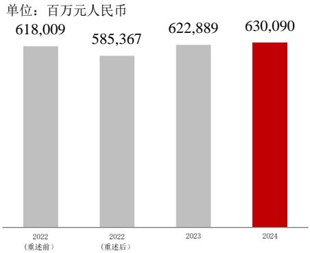  
营业收入

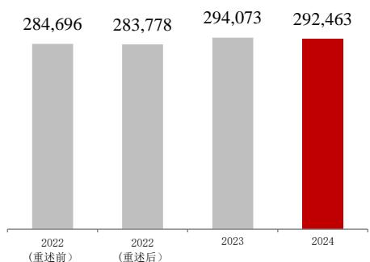  
营业利润   
单位：百万元人民币

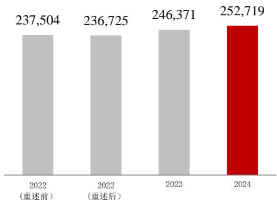  
净利润   
单位：百万元人民币

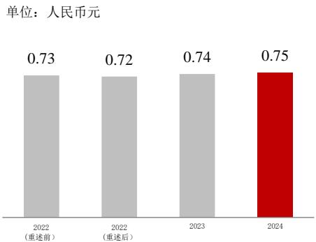  
基本每股收益

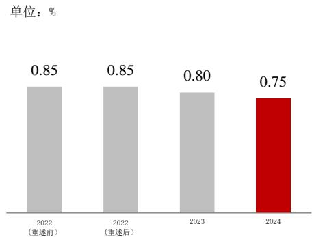  
平均总资产回报率

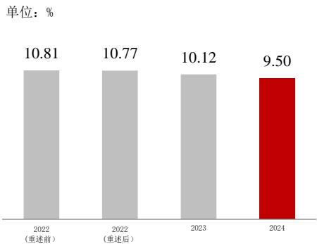  
净资产收益率

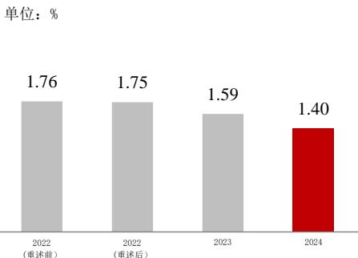  
净息差

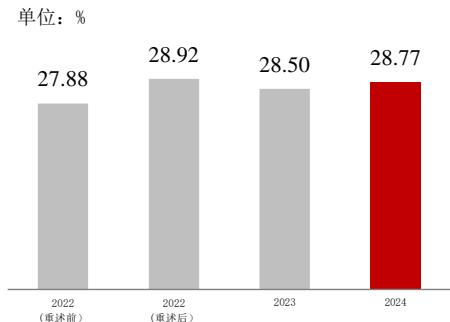  
成本收入比

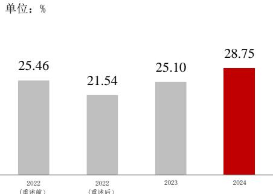  
非利息收入占比

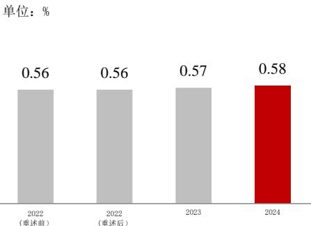  
信贷成本

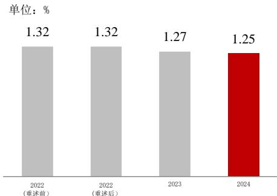  
不良贷款率

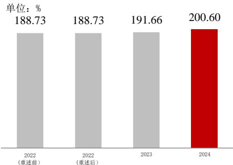  
不良贷款拨备覆盖率

注：本报告根据中国企业会计准则编制。除特别注明外，为本集团数据，以人民币列示。

单位：百万元人民币  

<table><tr><td></td><td>注释</td><td>2024年</td><td>2023年</td><td>2022年(重述后)</td><td>2022年(重述前)</td></tr><tr><td colspan="6">全年业绩1</td></tr><tr><td>利息净收入</td><td></td><td>448,934</td><td>466,545</td><td>459,266</td><td>460,678</td></tr><tr><td>非利息收入</td><td>2</td><td>181,156</td><td>156,344</td><td>126,101</td><td>157,331</td></tr><tr><td>营业收入</td><td></td><td>630,090</td><td>622,889</td><td>585,367</td><td>618,009</td></tr><tr><td>业务及管理费</td><td></td><td>(181,262)</td><td>(177,503)</td><td>(169,313)</td><td>(172,311)</td></tr><tr><td>资产减值损失</td><td>3</td><td>(102,722)</td><td>(106,562)</td><td>(103,959)</td><td>(103,993)</td></tr><tr><td>营业利润</td><td></td><td>292,463</td><td>294,073</td><td>283,778</td><td>284,696</td></tr><tr><td>利润总额</td><td></td><td>294,954</td><td>295,608</td><td>283,641</td><td>284,595</td></tr><tr><td>净利润</td><td></td><td>252,719</td><td>246,371</td><td>236,725</td><td>237,504</td></tr><tr><td>归属于母公司所有者的净利润</td><td></td><td>237,841</td><td>231,904</td><td>226,522</td><td>227,439</td></tr><tr><td>扣除非经常性损益后归属于母公司所有者的净利润</td><td>4</td><td>236,789</td><td>230,928</td><td>226,415</td><td>227,312</td></tr><tr><td>普通股股利总额</td><td>5</td><td>71,360</td><td>69,593</td><td>68,298</td><td>68,298</td></tr><tr><td colspan="6">于年底</td></tr><tr><td>资产总计</td><td></td><td>35,061,299</td><td>32,432,166</td><td>28,893,548</td><td>28,913,857</td></tr><tr><td>发放贷款和垫款总额</td><td></td><td>21,594,068</td><td>19,961,779</td><td>17,552,761</td><td>17,554,322</td></tr><tr><td>贷款减值准备</td><td>6</td><td>(539,177)</td><td>(485,298)</td><td>(437,241)</td><td>(437,241)</td></tr><tr><td>金融投资</td><td>7</td><td>8,360,277</td><td>7,158,717</td><td>6,435,244</td><td>6,445,743</td></tr><tr><td>负债合计</td><td></td><td>32,108,335</td><td>29,675,351</td><td>26,330,247</td><td>26,346,286</td></tr><tr><td>吸收存款</td><td></td><td>24,202,588</td><td>22,907,050</td><td>20,201,825</td><td>20,201,825</td></tr><tr><td>归属于母公司所有者权益合计</td><td></td><td>2,816,231</td><td>2,629,510</td><td>2,423,973</td><td>2,427,589</td></tr><tr><td>股本</td><td></td><td>294,388</td><td>294,388</td><td>294,388</td><td>294,388</td></tr><tr><td colspan="6">每股计</td></tr><tr><td>基本每股收益（元）</td><td></td><td>0.75</td><td>0.74</td><td>0.72</td><td>0.73</td></tr><tr><td>每股股利（税前，元）</td><td>8</td><td>0.2424</td><td>0.2364</td><td>0.232</td><td>0.232</td></tr><tr><td>每股净资产（元）</td><td>9</td><td>8.18</td><td>7.58</td><td>6.98</td><td>6.99</td></tr><tr><td colspan="6">主要财务比率</td></tr><tr><td>平均总资产回报率(%)</td><td>10</td><td>0.75</td><td>0.80</td><td>0.85</td><td>0.85</td></tr><tr><td>净资产收益率(%)</td><td>11</td><td>9.50</td><td>10.12</td><td>10.77</td><td>10.81</td></tr><tr><td>净息差(%)</td><td>12</td><td>1.40</td><td>1.59</td><td>1.75</td><td>1.76</td></tr><tr><td>非利息收入占比(%)</td><td>13</td><td>28.75</td><td>25.10</td><td>21.54</td><td>25.46</td></tr><tr><td>成本收入比（%）</td><td>14</td><td>28.77</td><td>28.50</td><td>28.92</td><td>27.88</td></tr><tr><td colspan="6">资本指标15</td></tr><tr><td>核心一级资本净额</td><td></td><td>2,344,261</td><td>2,161,825</td><td>1,991,342</td><td>1,991,342</td></tr><tr><td>其他一级资本净额</td><td></td><td>419,025</td><td>408,447</td><td>381,648</td><td>381,648</td></tr><tr><td>二级资本净额</td><td></td><td>842,286</td><td>727,136</td><td>573,481</td><td>573,481</td></tr><tr><td>核心一级资本充足率(%)</td><td></td><td>12.20</td><td>11.63</td><td>11.84</td><td>11.84</td></tr><tr><td>一级资本充足率(%)</td><td></td><td>14.38</td><td>13.83</td><td>14.11</td><td>14.11</td></tr><tr><td>资本充足率(%)</td><td></td><td>18.76</td><td>17.74</td><td>17.52</td><td>17.52</td></tr><tr><td colspan="6">资产质量</td></tr><tr><td>不良贷款率(%)</td><td>16</td><td>1.25</td><td>1.27</td><td>1.32</td><td>1.32</td></tr><tr><td>不良贷款拨备覆盖率(%)</td><td>17</td><td>200.60</td><td>191.66</td><td>188.73</td><td>188.73</td></tr><tr><td>信贷成本(%)</td><td>18</td><td>0.58</td><td>0.57</td><td>0.56</td><td>0.56</td></tr><tr><td>贷款拨备率(%)</td><td>19</td><td>2.50</td><td>2.44</td><td>2.50</td><td>2.50</td></tr><tr><td colspan="6">汇率</td></tr><tr><td>1美元兑人民币年末中间价</td><td></td><td>7.1884</td><td>7.0827</td><td>6.9646</td><td>6.9646</td></tr><tr><td>1欧元兑人民币年末中间价</td><td></td><td>7.5257</td><td>7.8592</td><td>7.4229</td><td>7.4229</td></tr><tr><td>1港币兑人民币年末中间价</td><td></td><td>0.9260</td><td>0.9062</td><td>0.8933</td><td>0.8933</td></tr></table>

# 注释

1 本集团采用了财政部颁布的《企业会计准则第 25号—保险合同》（简称“保险合同准则”），该准则的首次执行日是 2023年 1月 1日。根据保险合同准则的过渡要求，本集团重述了自 2022年1月1日起的相关比较数据，本报告中列示的自2022年1月 1日起的相关比较数据，均已相应重述。其他前期比较数据未重述。  
2 非利息收入 $\underline { { \underline { { \mathbf { \Pi } } } } } =$ 手续费及佣金净收入 $^ +$ 投资收益 $^ +$ 公允价值变动收益 $^ +$ 汇兑收益＋其他业务收入。  
3 资产减值损失 $=$ 信用减值损失 $^ +$ 其他资产减值损失。  
4 非经常性损益按照《公开发行证券的公司信息披露解释性公告第 1 号—非经常性损益(2023 年修订)》的要求确定与计算。  
5 普通股股利总额包含中期股利和末期股利，2024年末期股利尚待股东大会批准。  
6 贷款减值准备 $=$ 以摊余成本计量的贷款减值准备 $^ +$ 以公允价值计量且其变动计入其他综合收益的贷款减值准备。  
7 金融投资包括以公允价值计量且其变动计入当期损益的金融资产、以公允价值计量且其变动计入其他综合收益的金融资产、以摊余成本计量的金融资产。  
8 每股股利为本行派发给普通股股东的每股股利，包含中期股利和末期股利，2024年末期股利尚待股东大会批准。  
9 每股净资产 $=$ （期末归属于母公司所有者权益合计－其他权益工具） $\div$ 期末普通股股本总数。  
10 平均总资产回报率 $=$ 净利润 $\div$ 资产平均余额 $\times 1 0 0 \%$ 。资产平均余额 $=$ （期初资产总计 $^ +$ 期末资产总计） $\div 2$ 。  
11 净资产收益率 $=$ 归属于母公司所有者（普通股股东）的净利润 $\div$ 归属于母公司所有者（普通股股东）权益加权平均余额$\times 1 0 0 \%$ 。根据中国证监会《公开发行证券的公司信息披露编报规则第9号—净资产收益率和每股收益的计算及披露（2010年修订）》（证监会公告[2010]2号）的规定计算。  
12 净息差 $=$ 利息净收入 $\dot { . }$ 生息资产平均余额 $\times 1 0 0 \%$ 。平均余额为本集团管理账目未经审计的日均余额。  
13 非利息收入占比 $=$ 非利息收入 $\dot { . }$ 营业收入 $\times 1 0 0 \%$ 。  
14 成本收入比根据财政部《金融企业绩效评价办法》（财金[2016]35 号）的规定计算。  
15 2024年资本指标根据《商业银行资本管理办法》等相关规定计算，2023年及以前年度资本指标根据《商业银行资本管理办法（试行）》等相关规定计算。  
16 不良贷款率 $=$ 期末不良贷款余额 $\div$ 期末发放贷款和垫款总额 $\times 1 0 0 \%$ 。计算不良贷款率时，发放贷款和垫款不含应计利息。   
17 不良贷款拨备覆盖率 $=$ 期末贷款减值准备 $\div$ 期末不良贷款余额 $\times 1 0 0 \%$ 。计算不良贷款拨备覆盖率时，发放贷款和垫款不含应计利息。  
18 信贷成本 $=$ 贷款减值损失 $\div$ 发放贷款和垫款平均余额 $\lvert \times 1 0 0 \%$ 。发放贷款和垫款平均余额 $=$ （期初发放贷款和垫款总额＋期末发放贷款和垫款总额） $\div 2$ 。计算信贷成本时，发放贷款和垫款不含应计利息。  
19 贷款拨备率 $=$ 期末贷款减值准备 $\div$ 期末发放贷款和垫款总额 $\times 1 0 0 \%$ 。计算贷款拨备率时，发放贷款和垫款不含应计利息。

# 公司基本情况

法定中文名称

中国银行股份有限公司（简称“中国银行”）

法定英文名称

BANK OF CHINA LIMITED（简称“Bank ofChina”）

法定代表人、董事长

葛海蛟

副董事长、行长

张辉

董事会秘书、公司秘书

卓成文

地址：中国北京市西城区复兴门内大街 1 号

电话：(86) 10-6659 2638

电子信箱：ir@bankofchina.com

证券事务代表

姜卓

地址：中国北京市西城区复兴门内大街 1 号

电话：(86) 10-6659 2638

电子信箱：ir@bankofchina.com

注册地址

中国北京市西城区复兴门内大街 1号

办公地址

中国北京市西城区复兴门内大街 1 号

邮政编码：100818

电话：(86) 10-6659 6688

传真：(86) 10-6601 6871

国际互联网网址：www.boc.cn

客服和投诉电话：(86) 区号-95566

香港营业地点

中国香港花园道1号中银大厦

选定的信息披露报刊（A 股）

《中国证券报》《上海证券报》

《证券时报》《经济参考报》

披露年度报告的上交所网站

www.sse.com.cn

披露年度报告的香港交易所网站

www.hkexnews.hk

年度报告备置地点

中国银行股份有限公司总行

上海证券交易所

法律顾问

金杜律师事务所

年利达律师事务所

审计师

国内会计师事务所

安永华明会计师事务所（特殊普通合伙）

办公地址：中国北京市东城区东长安街 1号东方广场安永大楼 17 层

签字会计师：许旭明、张凡

国际会计师事务所

安永会计师事务所

办公地址：中国香港鲗鱼涌英皇道 979 号太古坊一座 27楼

签字会计师：涂珮施

统一社会信用代码

911000001000013428

金融许可证机构编码

B0003H111000001

注册资本

人民币贰仟玖佰肆拾叁亿捌仟柒佰柒拾玖

万壹仟贰佰肆拾壹元整

证券信息

A股：上海证券交易所

股票简称：中国银行

股票代码：601988

H股：香港联合交易所有限公司

股票简称：中国银行

股份代号：3988

境内优先股：上海证券交易所

第三期

优先股简称：中行优 3

优先股代码：360033

第四期

优先股简称：中行优 4

优先股代码：360035